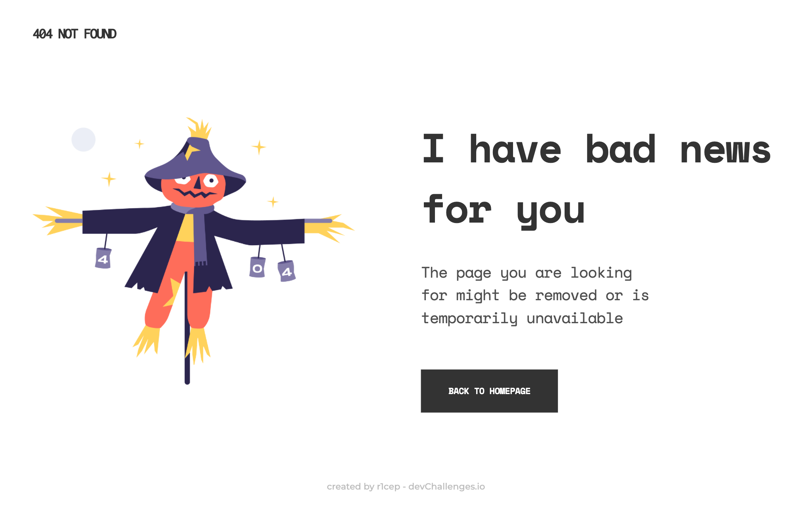
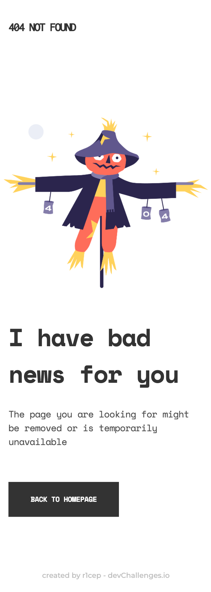

<!-- Please update value in the {}  -->

<h1 align="center">404 Not Found</h1>

   Solution for a challenge from  <a href="http://devchallenges.io" target="_blank">Devchallenges.io</a>.

  <h3>
    <a href="https://r1cep.github.io/dev-challenges-404-not-found/">
      Demo
    </a>
     | 
    <a href="https://github.com/r1cep/dev-challenges-404-not-found">
      Solution
    </a>
     | 
    <a href="https://devchallenges.io/challenges/wBunSb7FPrIepJZAg0sY">
      Challenge
    </a>
  </h3>

<!-- TABLE OF CONTENTS -->

## Table of Contents

- [Table of Contents](#table-of-contents)
- [Overview](#overview)
  - [Desktop](#desktop)
  - [Mobile](#mobile)
  - [Built With](#built-with)
- [Features](#features)
- [learned/improved](#learnedimproved)
- [Acknowledgements](#acknowledgements)
- [Contact](#contact)

<!-- OVERVIEW -->

## Overview

### Desktop

### Mobile

Introduce your projects by taking a screenshot or a gif. Try to tell visitors a story about your project by answering:

- Where can I see your demo?
- What was your experience?
- What have you learned/improved?
- Your wisdom? :)

### Built With

<!-- This section should list any major frameworks that you built your project using. Here are a few examples.-->

- [HTML: HyperText Markup Language | MDN](https://developer.mozilla.org/ja/docs/Web/HTML)
- [CSS: カスケーディングスタイルシート | MDN](https://developer.mozilla.org/ja/docs/Web/CSS)
- [Node.js](https://nodejs.org/): 18.7.0
- [Node.js](https://nodejs.org/ja/): 18.7.0
- [Vite | 次世代フロントエンドツール](https://ja.vitejs.dev/): 3.0.7

## Features

<!-- List the features of your application or follow the template. Don't share the figma file here :) -->

This application/site was created as a submission to a [DevChallenges](https://devchallenges.io/challenges) challenge. The [challenge](https://devchallenges.io/challenges/wBunSb7FPrIepJZAg0sY) was to build an application to complete the given user stories.

> User story: I can see a page following the given design

## learned/improved

- How to fix the footer bottom using `position: sticky`.
- How to deploy to GitHub Pages with GitHub Actions.

## Acknowledgements

<!-- This section should list any articles or add-ons/plugins that helps you to complete the project. This is optional but it will help you in the future. For exmpale -->

- [この実装方法は巧い！ コンテンツが少ない量でもフッタを一番下に配置するCSSのテクニック | コリス](https://coliss.com/articles/build-websites/operation/css/clever-sticky-footer-technique.html)
- [GitHub Pages サイトを作成する - GitHub Docs](https://docs.github.com/ja/pages/getting-started-with-github-pages/creating-a-github-pages-site)

## Contact

- GitHub [@r1cep](https://{github.com/r1cep)
